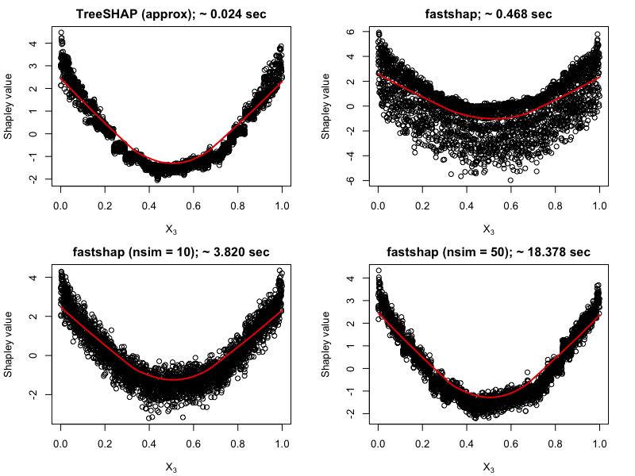
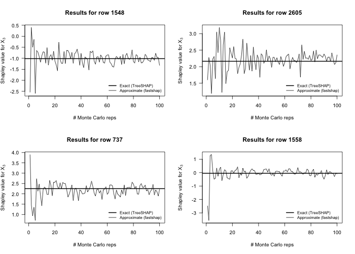

<!-- README.md is generated from README.Rmd. Please edit that file -->

```{r, include = FALSE}
knitr::opts_chunk$set(
  collapse = TRUE,
  comment = "#>",
  fig.path = "man/figures/README-",
  out.width = "100%"
)
```
# fastshap 

<!-- badges: start -->
<!-- badges: end -->

The goal of **fastshap** is to provide an efficient way to compute the approximate Shapley values discussed in [Section 5.8.3.3 of Christoph Molnar's IML book](https://christophm.github.io/interpretable-ml-book/shapley.html). 


**WARNING:** This package is a work in progress and the speed is likely to improve further over time (`r emo::ji("crossed fingers")`).

## Installation

You can install the development version of **fastshap** from GitHub:

``` r
if (!requireNamespace("remotes")) {
  install.packages("remotes")
}
remotes::install_github("bgreenwell/fastshap")
```

## General comments

* The `fastshap()` function was built for efficiency column-wise (in other words, it is not currently optimized if all you need are the Shapley values for a few rows)


## Example

The following example demonstrates the basic usage of the **fastshap** package.

```{r compute-shap, cache=TRUE}
# Load required packages
library(fastshap)  # for fast (approximate) Shapley values
library(mlbench)   # for Friedman 1 benchmark data set
library(ranger)    # for fast random forest algorithm

# Simulate training data
set.seed(101)
trn <- as.data.frame(mlbench.friedman1(3000))
X <- subset(trn, select = -y)  # feature columns only

# Fit a random forest
set.seed(102)
rfo <- ranger(y ~ ., data =  trn)

# Prediction wrapper
pfun <- function(object, newdata) {
  predict(object, data = newdata)$predictions
}

# Compute fast (approximate) Shapley values using 10 Monte Carlo repititions
system.time({  # estimate run time
  set.seed(5038)
  shap <- fastshap(rfo, X = X, pred_wrapper = pfun, nsim = 10)
})

# Results are returned as a tibble (with the additional "shap" class)
shap
```

You can use the results to interpret the model in many different ways. For example, in the code chunk below we take the sum of the absolute value of the Shapley values within each feature to construct a Shap-based feature variable importance plot:

```{r shap-importance, fig.width=6, fig.asp=0.618, out.width="70%"}
# Load required packages
library(ggplot2)
theme_set(theme_bw())

# Aggregate Shapley values
shap_imp <- data.frame(
  Variable = names(shap),
  Importance = apply(shap, MARGIN = 2, FUN = function(x) sum(abs(x)))
)

# Plot Shap-based variable importance
ggplot(shap_imp, aes(reorder(Variable, Importance), Importance)) +
  geom_col() +
  coord_flip() +
  xlab("") +
  ylab("mean(|Shapley value|)")
```

We can also plot the Shapley values for each feature to construct Shap-based dependence plots:

```{r shap-dependence, fig.width=6, fig.asp=0.618, out.width="70%"}
shap_dep_x3 <- data.frame(x3 = X[["x.3"]], shap = shap[["x.3"]])
ggplot(shap_dep_x3, aes(x3, shap)) +
  geom_point(alpha = 0.3) +
  geom_smooth() +
  ylab("Shapley value")
```

You can also use `autoplot()` to construct simple plots:

```{r shap-autoplot, cache=TRUE, fig.width=6, fig.asp=0.618, out.width="70%"}
p1 <- autoplot(shap)
p2 <- autoplot(shap, type = "dependence", feature = "x.3", X = X)
gridExtra::grid.arrange(p1, p2, nrow = 1)
```

By default, `fastshap()` computes approximate Shapley values for all rows in the training data. If you want Shapley values for new instances (or a subset of the training set), they must be supplied via the `newdata` argument. This functionality is demonstrated in the code chunk below. (**Note:** `fastshap()` is not yet optimized for this case; that is, computing only a handful of Shapley values for a few instances (in this case, at least for now, consider using the **iml** function `Shapley()`).)

```{r shap-newdata, cache=TRUE}
# Explanations for first observation; technically `drop = FALSE` isn't necessary 
# here since X is a data frame
fastshap(rfo, X = X, pred_wrapper = pfun, nsim = 10,
         newdata = X[1, , drop = FALSE])

# Explanations for first three observations
fastshap(rfo, X = X, feature_names = c("x.1", "x.10"), pred_wrapper = pfun, 
         nsim = 10, newdata = X[1:3, ])
```


### Parallel execution

Since **fastshap** uses the **plyr** package under the hood, you can use any parallel backend supported by the **foreach** package. This is illustrated in the code chunk below.

```{r shap-parallel, cache=TRUE}
# Load required packages
library(doParallel)

# Set up parallel backend
registerDoParallel(5)

# Compute Shapley values in parallel
fastshap(rfo, X = X, pred_wrapper = pfun, nsim = 10, .parallel = TRUE)
```

## Comparison with TreeSHAP/TreeExplainer for XGBoost models

You can compute the contributions of each feature for XGBoost models in an efficient way using the methods described in (Lundberg 2017). These are available through the `predict()` function for **xgboost** models; see `?xgboost::predict.xgb.Booster` for details. Below we compute the contributions for each feature using both methods and compare the results using a Shapley-based dependence plot on feature `x.3`, the results are quite surprising (__no parallel processing was used to obtain the **fastshap** results__). And remember, **fastshap** can be used with any prediction model in R. You can see the code that generated these benchmarks in the `slowtests/xgboost.R` file [here](https://github.com/bgreenwell/fastshap/blob/master/slowtests/xgboost.R).




We can also check that **fastshap** converges to the true Shapley values by comparing the results to TreeSHAP while varying the number of Monte Carlo repititions:




## References

Scott M. Lundberg, Su-In Lee, "A Unified Approach to Interpreting Model Predictions", NIPS Proceedings 2017, https://arxiv.org/abs/1705.07874

Scott M. Lundberg, Su-In Lee, "Consistent feature attribution for tree ensembles", https://arxiv.org/abs/1706.06060
