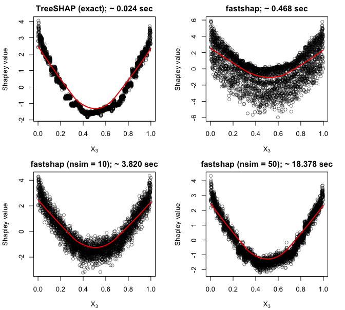
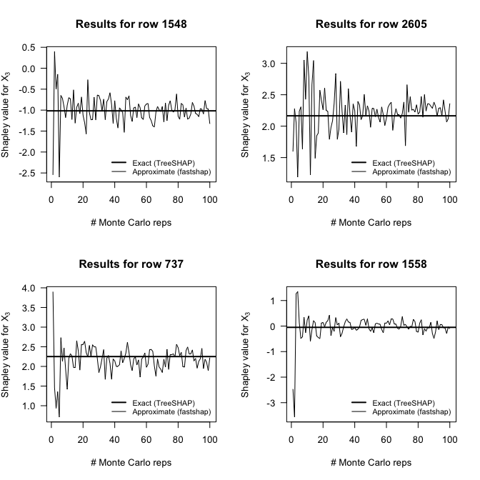

<!-- README.md is generated from README.Rmd. Please edit that file -->

# fastshap 

<!-- badges: start -->

[](https://travis-ci.org/bgreenwell/fastshap)
[](https://codecov.io/gh/bgreenwell/fastshap?branch=master)
<!-- badges: end -->

The goal of **fastshap** is to provide an efficient way to compute the
approximate Shapley values discussed in [Section 5.8.3.3 of Christoph
Molnar’s IML
book](https://christophm.github.io/interpretable-ml-book/shapley.html).


**WARNING:** This package is a work in progress and the speed is likely
to improve further over time (🤞).

## Installation

You can install the development version of **fastshap** from GitHub:

``` r
if (!requireNamespace("remotes")) {
  install.packages("remotes")
}
remotes::install_github("bgreenwell/fastshap")
```

## General comments

  - The `fastshap()` function was built for efficiency column-wise (in
    other words, it is not currently optimized if all you need are the
    Shapley values for a few rows)

## Example

The following example demonstrates the basic usage of the **fastshap**
package.

``` r
# Load required packages
library(fastshap)  # for fast (approximate) Shapley values
library(mlbench)   # for Friedman 1 benchmark data set
library(ranger)    # for fast random forest algorithm

# Simulate training data
set.seed(101)
trn <- as.data.frame(mlbench.friedman1(3000))
X <- subset(trn, select = -y)  # feature columns only

# Fit a random forest
set.seed(102)
rfo <- ranger(y ~ ., data =  trn)

# Prediction wrapper
pfun <- function(object, newdata) {
  predict(object, data = newdata)$predictions
}

# Compute fast (approximate) Shapley values using 10 Monte Carlo repetitions
system.time({  # estimate run time
  set.seed(5038)
  shap <- fastshap(rfo, X = X, pred_wrapper = pfun, nsim = 10)
})
#>    user  system elapsed 
#>  94.205   4.382  20.149

# Results are returned as a tibble (with the additional "shap" class)
shap
#> # A tibble: 3,000 x 10
#>        x.1    x.2     x.3    x.4     x.5      x.6      x.7     x.8      x.9
#>      <dbl>  <dbl>   <dbl>  <dbl>   <dbl>    <dbl>    <dbl>   <dbl>    <dbl>
#>  1  1.44    1.72  -0.641  -2.61  -0.622  -0.116   -3.46e-2  0.132  -0.0323 
#>  2 -2.50    1.32   0.931   0.152  1.48   -0.0499  -7.64e-2  0.0978  0.00546
#>  3  1.27    1.13  -0.647  -3.26  -0.684   0.0865   6.70e-3  0.0186  0.0290 
#>  4  0.331  -2.27  -0.0842  4.12   1.71   -0.0572  -4.23e-4 -0.0348 -0.0191 
#>  5 -1.06   -1.47  -0.537   3.85   1.23   -0.0519  -6.37e-3  0.102   0.0698 
#>  6 -1.32    1.82  -0.994  -2.35   1.12   -0.0366  -1.10e-2 -0.0795 -0.284  
#>  7  1.70    1.85   1.33   -4.95  -0.0251  0.00369  1.11e-1 -0.0315 -0.113  
#>  8  0.0995 -1.97   0.279   3.80  -0.278  -0.0995   4.03e-2 -0.0653  0.0301 
#>  9  2.09    0.847 -1.16    4.55  -0.923   0.0280  -9.44e-2 -0.0471  0.0301 
#> 10  0.865  -2.56  -0.971  -4.84   0.813  -0.0323   1.08e-2 -0.0415 -0.101  
#> # … with 2,990 more rows, and 1 more variable: x.10 <dbl>
```

You can use the results to interpret the model in many different ways.
For example, in the code chunk below we take the sum of the absolute
value of the Shapley values within each feature to construct a
Shap-based feature variable importance plot:

``` r
# Load required packages
library(ggplot2)
theme_set(theme_bw())

# Aggregate Shapley values
shap_imp <- data.frame(
  Variable = names(shap),
  Importance = apply(shap, MARGIN = 2, FUN = function(x) sum(abs(x)))
)

# Plot Shap-based variable importance
ggplot(shap_imp, aes(reorder(Variable, Importance), Importance)) +
  geom_col() +
  coord_flip() +
  xlab("") +
  ylab("mean(|Shapley value|)")
```


We can also plot the Shapley values for each feature to construct
Shap-based dependence plots:

``` r
shap_dep_x3 <- data.frame(x3 = X[["x.3"]], shap = shap[["x.3"]])
ggplot(shap_dep_x3, aes(x3, shap)) +
  geom_point(alpha = 0.3) +
  geom_smooth() +
  ylab("Shapley value")
```


You can also use `autoplot()` to construct simple plots:

``` r
p1 <- autoplot(shap)
p2 <- autoplot(shap, type = "dependence", feature = "x.3", X = X)
gridExtra::grid.arrange(p1, p2, nrow = 1)
```


By default, `fastshap()` computes approximate Shapley values for all
rows in the training data. If you want Shapley values for new instances
(or a subset of the training set), they must be supplied via the
`newdata` argument. This functionality is demonstrated in the code chunk
below. (**Note:** `fastshap()` is not yet optimized for this case; that
is, computing only a handful of Shapley values for a few instances (in
this case, at least for now, consider using the **iml** function
`Shapley()`).)

``` r
# Explanations for first observation; technically `drop = FALSE` isn't necessary 
# here since X is a data frame
fastshap(rfo, X = X, pred_wrapper = pfun, nsim = 10,
         newdata = X[1, , drop = FALSE])
#> # A tibble: 1 x 10
#>     x.1   x.2    x.3   x.4    x.5    x.6   x.7     x.8     x.9    x.10
#>   <dbl> <dbl>  <dbl> <dbl>  <dbl>  <dbl> <dbl>   <dbl>   <dbl>   <dbl>
#> 1 0.856  1.28 -0.722 -1.67 -0.140 -0.124 0.105 -0.0352 -0.0433 -0.0395

# Explanations for first three observations
fastshap(rfo, X = X, feature_names = c("x.1", "x.10"), pred_wrapper = pfun, 
         nsim = 10, newdata = X[1:3, ])
#> # A tibble: 3 x 2
#>      x.1    x.10
#>    <dbl>   <dbl>
#> 1 -0.137 -0.0866
#> 2 -3.06  -0.0477
#> 3  1.24  -0.0379
```

### Parallel execution

Since **fastshap** uses the **plyr** package under the hood, you can use
any parallel backend supported by the **foreach** package. This is
illustrated in the code chunk below.

``` r
# Load required packages
library(doParallel)

# Set up parallel backend
registerDoParallel(5)

# Compute Shapley values in parallel
fastshap(rfo, X = X, pred_wrapper = pfun, nsim = 10, .parallel = TRUE)
#> # A tibble: 3,000 x 10
#>       x.1    x.2     x.3    x.4    x.5      x.6      x.7      x.8      x.9
#>     <dbl>  <dbl>   <dbl>  <dbl>  <dbl>    <dbl>    <dbl>    <dbl>    <dbl>
#>  1 -0.999  1.46  -1.38   -2.68  -0.243  1.21e-2 -0.0120  -4.85e-2  0.0970 
#>  2 -3.25   2.04   0.330   0.754  1.23   9.64e-2  0.195   -5.46e-2 -0.0251 
#>  3  1.26   1.04  -1.44   -3.07  -1.77  -4.99e-3 -0.0502  -9.60e-2 -0.0453 
#>  4  1.60  -1.30  -0.0646  3.78   0.702  1.03e-1  0.0436  -3.01e-4  0.0362 
#>  5 -2.06  -1.81  -0.213   3.47   1.08  -1.12e-2 -0.00622 -9.22e-3  0.106  
#>  6  0.189  2.54  -1.54   -0.793  1.68   9.02e-2  0.0480  -3.12e-2 -0.532  
#>  7  1.69   2.20   1.19   -2.82  -0.626  2.63e-4  0.00911 -3.19e-2 -0.0271 
#>  8  1.39  -0.600  0.0137  2.53   0.219 -1.71e-2  0.0506  -3.71e-2  0.0455 
#>  9  1.45   0.854 -1.01    3.30  -0.754  4.85e-3  0.0206  -2.18e-2 -0.00183
#> 10  1.47  -0.944 -0.437  -3.80   1.00   2.28e-2 -0.0362  -6.68e-2 -0.0562 
#> # … with 2,990 more rows, and 1 more variable: x.10 <dbl>
```

## Comparison with TreeSHAP/TreeExplainer for XGBoost models

You can compute the contributions of each feature for XGBoost models in
an efficient way using the methods described in (Lundberg 2017). These
are available through the `predict()` function for **xgboost** models;
see `?xgboost::predict.xgb.Booster` for details. Below we compute the
contributions for each feature using both methods and compare the
results using a Shapley-based dependence plot on feature `x.3`, the
results are quite surprising (**no parallel processing was used to
obtain the **fastshap** results**). And remember, **fastshap** can be
used with any prediction model in R. You can see the code that generated
these benchmarks in the `slowtests/xgboost.R` file
[here](https://github.com/bgreenwell/fastshap/blob/master/slowtests/xgboost.R).



We can also check that **fastshap** converges to the true Shapley values
by comparing the results to TreeSHAP while varying the number of Monte
Carlo
repetitions:



## References

Scott M. Lundberg, Su-In Lee, “A Unified Approach to Interpreting Model
Predictions”, NIPS Proceedings 2017, <https://arxiv.org/abs/1705.07874>

Scott M. Lundberg, Su-In Lee, “Consistent feature attribution for tree
ensembles”, <https://arxiv.org/abs/1706.06060>
