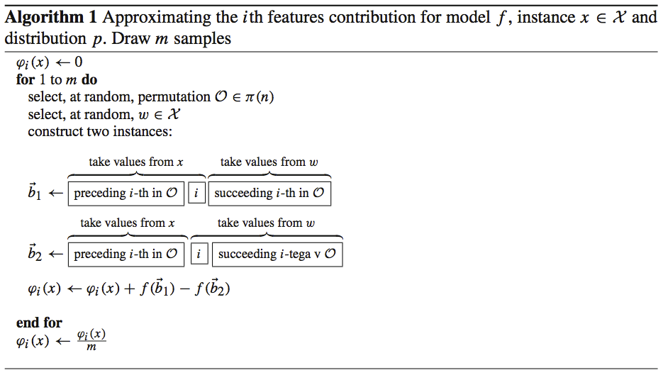

```{r, include = FALSE}
knitr::opts_chunk$set(
  cache = TRUE,
  collapse = TRUE,
  comment = "#>"
)
```

```{r setup}
library(fastshap)
```


## Background

The approach in this package is similar to what's described in **Algorithm 1** in Strumbelj and Kononenko (2014) which is reproduced below:

```{r algorithm1, echo=FALSE}

```

The problem with this approach is that it requires many calls to the scoring function *f()*. In particular, if we have *N* training records and *p* features, than this algorithm would require *2mnp* calls to *f()* in order to obtain approximate Shapley values for the entire training set. The approach we take is similar, but rather than computing each Monte Carlo estimate one at a time, we construct all the data required to compute the approximate Shapley values for a single feature at once and only use two calls to *f()*. Using this approach only requires *2mp* calls to *f()* to obtain approximate Shapley values for all *p* features for the entire training set. Hence, this approach will scale better to larger training sets. Also, the data instances **b<sub>1</sub>** and **b<sub>2</sub>** are built efficiently for each row in the training set (or subset thereof) all at once and stacked on top of each other in a data frame or matrix using C++ and logical subsetting. We can also parallelize the algorithm across *m* or *p*, depending on which one is more beneficial.


## General comments

* The `explain()` function was built for efficiency column-wise (in other words, it is not currently optimized if all you need are the Shapley values for a few rows)


## Example

The following example demonstrates the basic usage of the **fastshap** package.

```{r compute-shap}
# Load required packages
library(fastshap)  # for fast (approximate) Shapley values
library(mlbench)   # for Friedman 1 benchmark data set
library(ranger)    # for fast random forest algorithm

# Simulate training data
set.seed(101)
trn <- as.data.frame(mlbench.friedman1(3000))
X <- subset(trn, select = -y)  # feature columns only

# Fit a random forest
set.seed(102)
rfo <- ranger(y ~ ., data =  trn)

# Prediction wrapper
pfun <- function(object, newdata) {
  predict(object, data = newdata)$predictions
}

# Compute fast (approximate) Shapley values using 10 Monte Carlo repetitions
system.time({  # estimate run time
  set.seed(5038)
  shap <- explain(rfo, X = X, pred_wrapper = pfun, nsim = 10)
})

# Results are returned as a tibble (with the additional "shap" class)
shap
```

You can use the results to help interpret the model in many different ways. For example, in the code chunk below we take the sum of the absolute value of the Shapley values within each feature to construct a Shap-based feature variable importance plot:

```{r shap-importance, fig.width=6, fig.asp=0.618, out.width="70%"}
# Load required packages
library(ggplot2)
theme_set(theme_bw())

# Aggregate Shapley values
shap_imp <- data.frame(
  Variable = names(shap),
  Importance = apply(shap, MARGIN = 2, FUN = function(x) sum(abs(x)))
)

# Plot Shap-based variable importance
ggplot(shap_imp, aes(reorder(Variable, Importance), Importance)) +
  geom_col() +
  coord_flip() +
  xlab("") +
  ylab("mean(|Shapley value|)")
```

We can also plot the Shapley values for each feature to construct Shap-based dependence plots:

```{r shap-dependence, fig.width=6, fig.asp=0.618, out.width="70%"}
shap_dep_x3 <- data.frame(x3 = X[["x.3"]], shap = shap[["x.3"]])
ggplot(shap_dep_x3, aes(x3, shap)) +
  geom_point(alpha = 0.3) +
  geom_smooth() +
  ylab("Shapley value")
```

You can also use `autoplot()` to construct simple plots:

```{r shap-autoplot, fig.width=7, fig.asp=0.4, out.width="70%"}
p1 <- autoplot(shap)
p2 <- autoplot(shap, type = "dependence", feature = "x.3", X = X, alpha = 0.5,
               color_by = "x.2", smooth = TRUE, smooth_color = "black") +
        scale_color_viridis_c()
gridExtra::grid.arrange(p1, p2, nrow = 1)
```

By default, `explain()` computes approximate Shapley values for all rows in the training data. If you want Shapley values for new instances (or a subset of the training set), they must be supplied via the `newdata` argument. This functionality is demonstrated in the code chunk below. (**Note:** `explain()` is not yet optimized for this case; that is, computing only a handful of Shapley values for a few instances (in this case, at least for now, consider using the **iml** function `Shapley()`).)

```{r shap-newdata}
# Explanations for first observation; technically `drop = FALSE` isn't necessary 
# here since X is a data frame
explain(rfo, X = X, pred_wrapper = pfun, nsim = 10,
        newdata = X[1, , drop = FALSE])

# Explanations for first three observations
explain(rfo, X = X, feature_names = c("x.1", "x.10"), pred_wrapper = pfun, 
        nsim = 10, newdata = X[1:3, ])
```


### Parallel execution

With **fastshap** you can compute contributions for multiple features in parallel using any parallel backend supported by the **foreach** package. This is illustrated in the code chunk below. 

```{r shap-parallel}
# Load required packages
library(doParallel)

# Set up parallel backend
cl <- if (.Platform$OS.type == "unix") 8 else makeCluster(8)
registerDoParallel(cl)

# Compute Shapley values in parallel
explain(rfo, X = X, pred_wrapper = pfun, nsim = 10, .parallel = TRUE)
```


## Comparison with TreeSHAP/TreeExplainer for XGBoost models

You can compute the contributions of each feature for XGBoost models in an efficient way using the methods described in [(Lundberg 2017)](https://arxiv.org/abs/1705.07874). These are available through the `predict()` function for **xgboost** models; see `?xgboost::predict.xgb.Booster` for details. Below we compute the contributions for each feature using both methods and compare the results using a Shapley-based dependence plot on feature `x.3`, the results are quite surprising (__no parallel processing was used to obtain the **fastshap** results__). And remember, **fastshap** can be used with any prediction model in R. 

```{r fastshap-vs-treeshap, echo=FALSE}
# Load required packages
library(xgboost)

# Ames housing data
set.seed(101)
trn <- as.data.frame(mlbench::mlbench.friedman1(3000))
X <- subset(trn, select = -y)  # feature columns only

# # Use 5-fold CV to tune an XGBoost model
# set.seed(102)
# bst.cv <- xgb.cv(data = data.matrix(X), label = trn$y,
#                  max_depth = 2, eta = 0.3, nround = 1000, 
#                  nfold = 5, objective = "reg:linear")
# plot(test_rmse_mean ~ iter, data = bst.cv$evaluation_log)
# best_iter <- which.min(bst.cv$evaluation_log$test_rmse_mean)

# Fit an XGBoost model
set.seed(103)
bst <- xgboost(data = data.matrix(X), label = trn$y,
               max_depth = 2, eta = 0.3, nround = 300, 
               objective = "reg:linear", verbose = 0)

# Use built-in SHAP functionality
time1 <- system.time({
  set.seed(104)
  tree_shap <- predict(bst, newdata = data.matrix(X), predcontrib = TRUE,
                       approxcontrib = FALSE)
})

# Remove BIAS column
tree_shap <- tree_shap[, setdiff(colnames(tree_shap), "BIAS")]

# Use fastshap package
pfun <- function(object, newdata) {
  predict(object, newdata = data.matrix(newdata))
}
time2 <- system.time({
  set.seed(105)
  shap1 <- explain(bst, X = X, pred_wrapper = pfun)
})
time3 <- system.time({
  set.seed(107)
  shap10 <- explain(bst, X = X, pred_wrapper = pfun, nsim = 10)
})
time4 <- system.time({
  set.seed(108)
  shap50 <- explain(bst, X = X, pred_wrapper = pfun, nsim = 50)
})

# Simulate results for X3 using fastshap with various iterations
set.seed(6292)  # for reproducibility
res <- NULL
nsim <- 100
for (i in 1:nsim) {
  # message("Iter ", i, " of ", nsim, "...")
  shap <- explain(bst, feature_names = "x.3", X = X, pred_wrapper = pfun, 
                   nsim = i)
  res <- cbind(res, data.matrix(shap))
}
```

```{r fastshap-comparison, echo=FALSE, fig.width=7, fig.asp=0.9, out.width="70%"}
# Compare plots
par(mfrow = c(2, 2), mar = c(4, 4, 2, 2) + 0.1) 
plot(X[, 3], tree_shap[, 3, drop = TRUE], main = "TreeSHAP (exact); ~ 0.025 sec",
     xlab = expression(X[3]), ylab = "Shapley value", 
     col = adjustcolor("black", alpha.f = 0.5))
lines(lowess(X[, 3], tree_shap[, 3, drop = TRUE]), lwd = 2, col = "red2")
plot(X[, 3], shap1[, 3, drop = TRUE], main = "fastshap; ~ 0.449 sec",
     xlab = expression(X[3]), ylab = "Shapley value", 
     col = adjustcolor("black", alpha.f = 0.5))
lines(lowess(X[, 3], shap1[, 3, drop = TRUE]), lwd = 2, col = "red2")
plot(X[, 3], shap10[, 3, drop = TRUE], main = "fastshap (nsim = 10); ~ 3.121 sec",
     xlab = expression(X[3]), ylab = "Shapley value", 
     col = adjustcolor("black", alpha.f = 0.5))
lines(lowess(X[, 3], shap10[, 3, drop = TRUE]), lwd = 2, col = "red2")
plot(X[, 3], shap50[, 3, drop = TRUE], main = "fastshap (nsim = 50); ~ 15.600 sec",
     xlab = expression(X[3]), ylab = "Shapley value", 
     col = adjustcolor("black", alpha.f = 0.5))
lines(lowess(X[, 3], shap50[, 3, drop = TRUE]), lwd = 2, col = "red2")
```

We can also check that **fastshap** converges to the true Shapley values by comparing the results to TreeSHAP while varying the number of Monte Carlo repetitions:

```{r fastshap-convergence, echo=FALSE, fig.width=7, fig.asp=0.9, out.width="70%"}
# Plot results for a random sample of rows
set.seed(2840)  # for reproducibility
par(mfrow = c(2, 2)) 
for (i in sample(nrow(tree_shap), size = 4)) {
  plot(
    res[i, ], 
    type = "l", 
    main = paste("Results for row", i),
    xlab = "# Monte Carlo reps", 
    ylab = expression(paste("Shapley value for ", X[3])),
    las = 1
  )
  abline(h = tree_shap[i, 3], lwd = 2)
  legend("bottomright", lwd = c(2, 1), inset = 0.01, bty = "n", cex = 0.8,
         legend = c("Exact (TreeSHAP)", "Approximate (fastshap)"))
}
```


## References

Scott M. Lundberg, Su-In Lee, "A Unified Approach to Interpreting Model Predictions", NIPS Proceedings 2017, https://arxiv.org/abs/1705.07874.

Scott M. Lundberg, Su-In Lee, "Consistent feature attribution for tree ensembles", https://arxiv.org/abs/1706.06060.

Christoph Molnar, _Interpretable Machine Learning_. 2019. https://christophm.github.io/interpretable-ml- book/.
