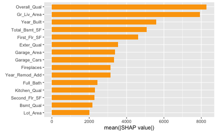

In this vignette, we'll cover basic usage of [fastshap](https://cran.r-project.org/package=fastshap) for computing feature contributions for both local and global explanations, and show how to visualize the output using the [shapviz](https://cran.r-project.org/package=shapviz) package. To start, we'll use the [ranger](https://cran.r-project.org/package=ranger) package to build a random forest to predict (and explain) survivability of passengers on the ill-fated Titanic. 

The [source data](https://hbiostat.org/data/) (also available in `fastshap::titanic`) contains 263 missing values (i.e., `NA`'s) in the age column. The `titanic_mice` version, which we'll use in this vignette, contains imputed values for the age column using *multivariate imputation by chained equations* via the [mice](https://cran.r-project.org/package=mice) package. Consequently, `titanic_mice` is a list containing 11 imputed versions of the original data; see `?fastshap::titanic_mice` for details. For now, we'll just use one of the 11 imputed versions:


```r
library(fastshap)

head(t1 <- titanic_mice[[1L]])
```

```
##   survived pclass   age    sex sibsp parch
## 1      yes      1 29.00 female     0     0
## 2      yes      1  0.92   male     1     2
## 3       no      1  2.00 female     1     2
## 4       no      1 30.00   male     1     2
## 5       no      1 25.00 female     1     2
## 6      yes      1 48.00   male     0     0
```

```r
t1$pclass <- as.ordered(t1$pclass)  # makes more sense as an ordered factor
```

Next, we'll build a default [*probability forest*](https://doi.org/10.3414/ME00-01-0052) which uses the *Brier score* to determine splits.


```r
library(ranger)

set.seed(2053)  # for reproducibility
(rfo <- ranger(survived ~ ., data = t1, probability = TRUE))
```

```
## Ranger result
## 
## Call:
##  ranger(survived ~ ., data = t1, probability = TRUE) 
## 
## Type:                             Probability estimation 
## Number of trees:                  500 
## Sample size:                      1309 
## Number of independent variables:  5 
## Mtry:                             2 
## Target node size:                 10 
## Variable importance mode:         none 
## Splitrule:                        gini 
## OOB prediction error (Brier s.):  0.1341913
```

## Local explanations

To illustrate the simplest use of Shapley values for quantifying feature contributions, we need an observation to predict. While we can use any observation from the training set, we'll construct an observation for a new passenger. Everyone, meet Jack:


```r
jack.dawson <- data.frame(
  #survived = 0L,  # in case you haven't seen the movie
  pclass = 3L,     # third-class passenger
  age = 20.0,      # twenty years old
  sex = factor("male", levels = c("female", "male")),  # male
  sibsp = 0L,      # no siblings/spouses aboard
  parch = 0L       # no parents/children aboard
)
```

Note that [fastshap](https://cran.r-project.org/package=fastshap), like many other [machine learning interpretability](https://christophm.github.io/interpretable-ml-book/) packages (e.g., [iml](https://cran.r-project.org/package=iml)), requires a user-specified prediction wrapper; that is, a simple function that tells [fastshap](https://cran.r-project.org/package=fastshap) how to extract the appropriate predictions from the fitted model. In this case, we want to explain Jack's likelihood of survival, so our prediction wrapper[^1] needs to return the conditional probability of surviving from a fitted [ranger](https://cran.r-project.org/package=fastshap) object; see `?ranger::predict.ranger` for details:

[^1]: As described in `?fastshap::explain`, the prediction wrapper requires two arguments, `object` and `newdata`.


```r
pfun <- function(object, newdata) {  # prediction wrapper
  unname(predict(object, data = newdata)$predictions[, "yes"])
}

# Compute Jack's predicted likelihood of survival
(jack.prob <- pfun(rfo, newdata = jack.dawson))
```

```
## [1] 0.1330587
```

```r
# Average prediction across all passengers
(baseline <- mean(pfun(rfo, newdata = t1)))  
```

```
## [1] 0.3815068
```

```r
# Difference between Jack and average
(difference <- jack.prob - baseline)
```

```
## [1] -0.2484481
```

Yikes, Jack isn't predicted to have fared too well on this voyage, at least compared to the baseline (i.e., average training prediction)! Can we try to understand why Jack's predicted likelihood of survival is so much smaller than the average? Of course, this is the difference Shapley-based feature contributions help to explain.

To illustrate, we'll use the `explain()` function to estimate how each of jack features[^2] (i.e., his age and sex) contributed to the difference:

[^2]: Note that we need to supply the training features via the `X` argument (i.e., no response column) and that `newdata` should also only contain columns of feature values.


```r
X <- subset(t1, select = -survived)  # features only
set.seed(2113)  # for reproducibility
(ex.jack <- explain(rfo, X = X, pred_wrapper = pfun, newdata = jack.dawson))
```

```
##      pclass          age sex      sibsp parch
## [1,]      0 -0.006721834   0 0.03017177     0
## attr(,"baseline")
## [1] 0
## attr(,"class")
## [1] "explain" "matrix"  "array"
```

The [fastshap](https://cran.r-project.org/package=fastshap) package uses an efficient version of the Monte-Carlo (MC) algorithm described in @strumbelj-2014-explaining. Consequently, for stability and accuracy, the feature contributions should be computed many times and the results averaged together. To accomplish this, simply set the `nsim` argument to a reasonably high value (i.e., as much as you can computationally afford). Below we compute 1000 Shapley-based feature contributions for Jack and average the results:


```r
set.seed(2129)  # for reproducibility
(ex.jack <- explain(rfo, X = X, pred_wrapper = pfun, newdata = jack.dawson,
                    nsim = 1000))
```

```
##           pclass          age        sex       sibsp       parch
## [1,] -0.07878601 -0.009507426 -0.1417691 0.005069262 -0.01201627
## attr(,"baseline")
## [1] 0
## attr(,"class")
## [1] "explain" "matrix"  "array"
```

Note that the MC approach used by [fastshap](https://cran.r-project.org/package=fastshap) (and other packages) will not produce Shapley-based feature contributions that satisfy the [efficiency property](https://christophm.github.io/interpretable-ml-book/shapley.html#the-shapley-value-in-detail); that is, they won't add up to the difference between the corresponding prediction and baseline (i.e., average training prediction). However, borrowing a trick from the popular Python [shap](https://github.com/shap/shap) library, we can use a regression-based adjustment to correct the sum. To do this, simply set `adjust = TRUE` in the call to `explain()`^[Note that `nsim` has to be larger than one whenever setting `adjust = TRUE`.]:


```r
set.seed(2133)  # for reproducibility
(ex.jack.adj <- explain(rfo, X = X, pred_wrapper = pfun, newdata = jack.dawson,
                        nsim = 1000, adjust = TRUE))
```

```
##           pclass         age        sex       sibsp       parch
## [1,] -0.07299993 -0.02063907 -0.1491682 0.007971709 -0.01361257
## attr(,"baseline")
## [1] 0.3815068
## attr(,"class")
## [1] "explain" "matrix"  "array"
```

```r
# Sanity check
sum(ex.jack.adj)  # should be -0.2484481
```

```
## [1] -0.2484481
```

Next, we can use the [shapviz](https://cran.r-project.org/package=shapviz) package to produce several useful visualizations for either a vector or matrix of Shapley values. Below, we create a simple waterfall chart to visualize how Jack's features contributed to his relatively low predicted probability of surviving:


```r
library(shapviz)

shv <- shapviz(ex.jack.adj, X = jack.dawson, baseline = baseline)
sv_waterfall(shv)
```


Clearly, the fact the Jack was a male, third-class passenger contributed the most to pushing his predicted probability of survival down below the baseline. *Force plots* are another popular way to visualize Shapley values for explaining a single prediction:


```r
sv_force(shv)
```


Although force plots are cool, waterfall charts seem to be a much more effective way of visualizing feature contributions for a single prediction; especially when there's a large number of features.


## Global explanations

Aside from explaining individual prediction (i.e., *local explanation*), it can be useful to aggregate the results of several (i.e., all of the training predictions) into an overall global summary about the model (i.e., global explanations). However, computing Shapley values for a large number of observations can be quite computationally expensive, especially when using the MC approach. However, [fastshap](https://cran.r-project.org/package=fastshap) is quite efficient compared to alternative implementations^[For large-ish data sets, you should always run `it `explain()` on a smaller subsample with `nsim = 1` to gauge how much compute you can afford]. The code chunk below computes Shapley explanations for each passenger in the training data using 1000 MC repetitions, and coerces the resulting matrix to a [tibble](https://cran.r-project.org/package=tibble) (for nicer printing).


```r
set.seed(2224)  # for reproducibility
ex.t1 <- explain(rfo, X = X, pred_wrapper = pfun, nsim = 100, adjust = TRUE,
                 shap_only = FALSE)
tibble::as_tibble(ex.t1$shapley_values)
```

```
## # A tibble: 1,309 × 5
##    pclass      age     sex      sibsp    parch
##     <dbl>    <dbl>   <dbl>      <dbl>    <dbl>
##  1  0.231  0.00815  0.315   0.0205    -0.00924
##  2  0.140  0.330   -0.0767  0.00589    0.0772 
##  3  0.161  0.0293   0.126  -0.0263    -0.0252 
##  4  0.214 -0.0231  -0.186   0.0156     0.00436
##  5  0.193 -0.0328   0.286  -0.0183    -0.0468 
##  6  0.171 -0.0320  -0.197   0.0000595 -0.00303
##  7  0.176 -0.127    0.345  -0.0103     0.00340
##  8  0.151 -0.0713  -0.189  -0.00363   -0.0138 
##  9  0.239  0.00252  0.296   0.0437     0.00567
## 10  0.112 -0.111   -0.210   0.00154   -0.00452
## # ℹ 1,299 more rows
```

Note that I set the optional argument `shap_only = FALSE` here. This is a convenience argument when working with [shapviz](https://cran.r-project.org/package=shapviz); in short, setting this to `FALSE` will return a list containing the Shapely values, feature values, and baseline (all of which can be used by [shapviz](https://cran.r-project.org/package=shapviz)'s plotting functions). 

A common global measure computed from Shapley values is the Shapley-based feature importance scores, which are nothing more than the mean of the absolute value of the features contribution for each column:


```r
shv.global <- shapviz(ex.t1)
sv_importance(shv)  
```


Another common global visualization is the Shapley dependence plot, akin to a [*partial dependence plot*](https://cran.r-project.org/package=pdp). Here, we'll look at the dependence of the feature contribution of `age` on its input value:


```r
sv_dependence(shv.global, v = "age")
```


## Parallel processing

The `explain()` function computes Shapley values one column at a time (in a very efficient way). However, if you have a lot of features, it may be beneficial to run `explain()` in parallel across all the columns. Since `explain()` uses [foreach](https://cran.r-project.org/package=foreach) to loop through features when computing Shapley values, you can use any parallel backend it support; for details, see the parallel execution section of the "Using the `foreach` package" vignette, which you can view with `vignette("foreach", package = "foreach")`.

To illustrate, we'll compute Shapley values from a random forest fit to the Ames housing data available in the [AmesHousing](https://cran.r-project.org/package=AmesHousing) package:


```r
ames <- as.data.frame(AmesHousing::make_ames())
X <- subset(ames, select = -Sale_Price)  # features only

# Fit a random forest
set.seed(102)
(rfo <- ranger(Sale_Price ~ ., data =  ames, write.forest = TRUE))
```

```
## Ranger result
## 
## Call:
##  ranger(Sale_Price ~ ., data = ames, write.forest = TRUE) 
## 
## Type:                             Regression 
## Number of trees:                  500 
## Sample size:                      2930 
## Number of independent variables:  80 
## Mtry:                             8 
## Target node size:                 5 
## Variable importance mode:         none 
## Splitrule:                        variance 
## OOB prediction error (MSE):       622600969 
## R squared (OOB):                  0.9024424
```

Again, we'll define the required prediction wrapper and call the `explain()` function without passing anything to `newdata` (i.e., Shapley values for the predictions of every row in `X` will be computed):


```r
# Prediction wrapper
pfun <- function(object, newdata) {
  predict(object, data = newdata)$predictions
}

# Without parallelism
set.seed(1706)
system.time({  # estimate run time
  ex.ames.nonpar <- explain(rfo, X = X, pred_wrapper = pfun, nsim = 50,
                            adjust = TRUE)
})
```

```
## Predicting.. Progress: 36%. Estimated remaining time: 2 minutes, 9 seconds.
```

```
##     user   system  elapsed 
## 2390.225  187.328  950.160
```

Honestly, not that bad for 50 MC repetitions on a data set with 80 features on 2930 rows!

For comparison, we'll run the same computation, but this time in parallel using the [doParallel](https://cran.r-project.org/package=doParallel) package to execute across 12 cores:


```r
library(doParallel)

# With parallelism
registerDoParallel(cores = 12)  # use forking with 12 cores
set.seed(5038)
system.time({  # estimate run time
  ex.ames.par <- explain(rfo, X = X, pred_wrapper = pfun, nsim = 50, 
                         adjust = TRUE, parallel = TRUE)
})
```

```
##     user   system  elapsed 
##      0.948   0.632 265.087
```

Not a bad speedup!

Since we didn't set `shap_only=FALSE` in the call to `explain()`, we'll need to pass the corresponding feature values and baseline when interfacing with [shapviz](https://cran.r-project.org/package=shapviz). By default, as long as `adjust = TRUE`, the baseline will be automatically computed as the average training prediction (or whatever suitable background feature set is provided via `X`) and stored in the `"baseline"` of the returned matrix when `shap_only=TRUE`, or the `"baseline"` component of the returned object when `shap_only=FALSE`.

For instance, to construct a Shapley-based variable importance plot from the `ex.ames.par` object, we can simply do the following:


```r
baseline <- attr(ex.ames.par, "baseline")
shv <- shapviz(ex.ames.par, X = X, baseline = baseline)
sv_importance(shv)
```



Similar for Shapley-based dependence plots:


```r
sv_dependence(shv, v = "Gr_Liv_Area", alpha = 0.3)
```


